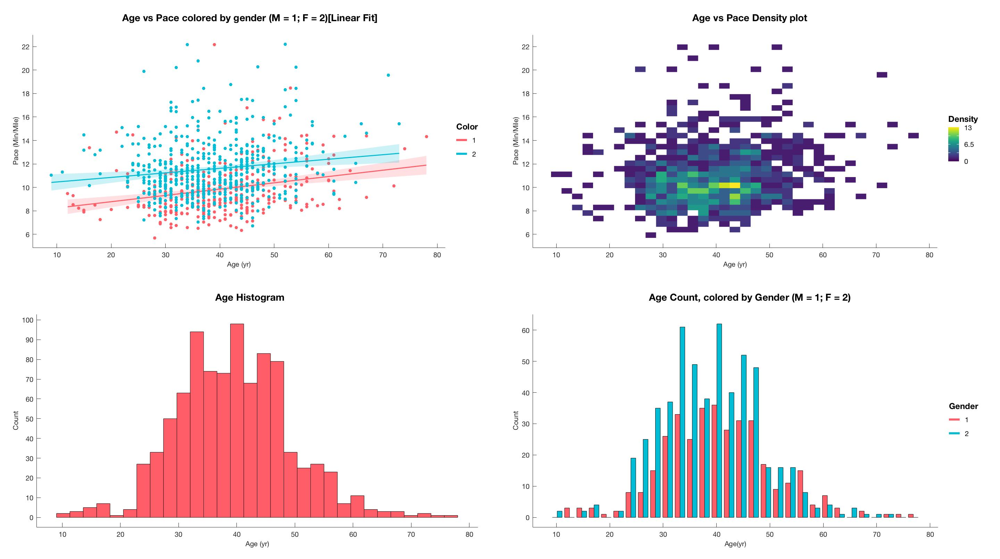
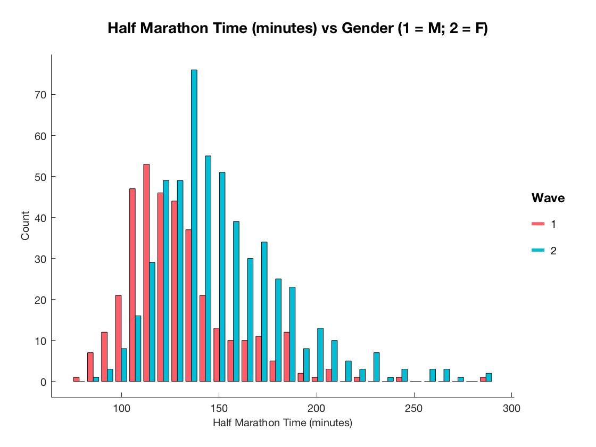

# Silver Falls Half Marathon Data

This was an experiment with the Matlab gramm package, which allowed for easy GGplot style figures.

I took data from the Silver Falls Half Marathon in Oregon to develop a series of visualizations of race results.

Here are just a few plots exploring this dataset.

Half Marathon time vs Gender

This was just a fun chance to get used to the grammar of graphics before diving more into R and GGplot later on. 
